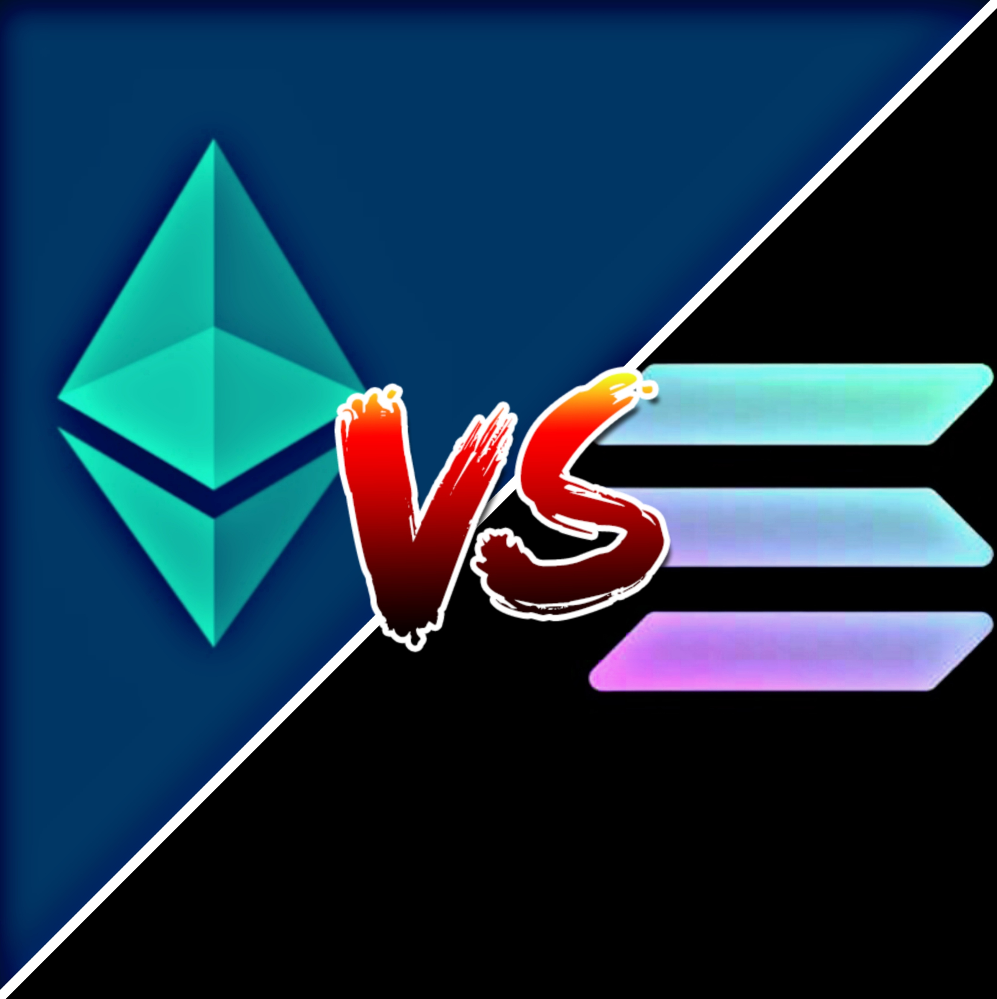
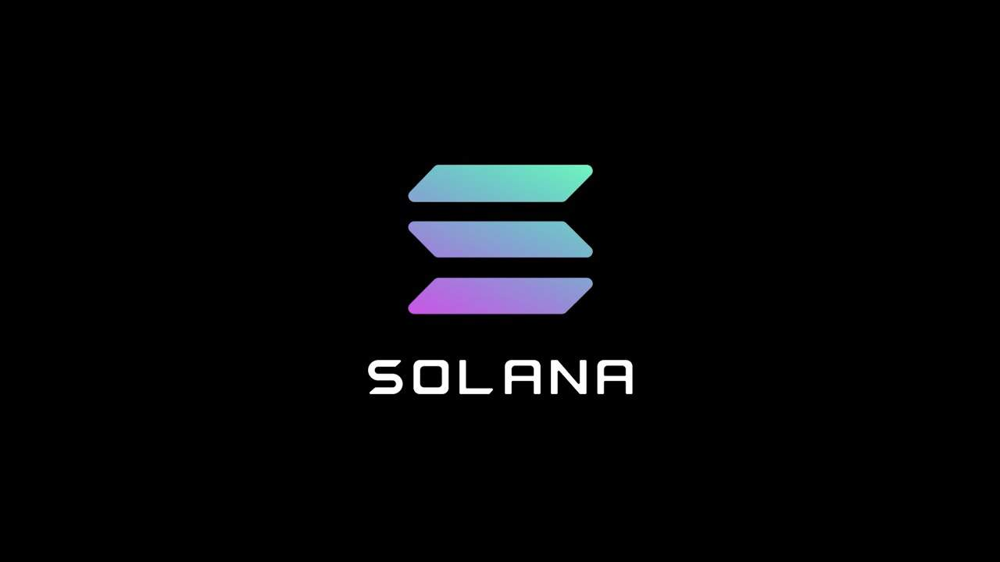

# Fee-Compare
In this informative project I will show comparison transection fees between defi products (that mostly runs on ETH network) and the solana (SOL) chain.

   

# Eth Network 

1. The average Ethereum transaction fee has passed $20 for the first time. Ethereum last broke its transaction fee record a month ago on Jan. 11, hitting an average $19 per transaction. Current values double the peak transaction fees recorded during "DeFi Summer" of 2020. 
2. Ethereum Average Transaction Fee measures the average fee in USD when an Ethereum transaction is processed by a miner and confirmed. Average Ethereum transaction fees can spike during periods of congestion on the network, as they did during the 2017 to early 2018 crypto boom where they reached around 3 USD.
3. Ethereum Average Transaction Fee is at a current level of 23.27, up from 16.61 yesterday and up from 0.149 one year ago. This is a change of 40.10% from yesterday and 15.52K% from one year ago.
# According to the Blockchair indicates

The increase in the cost of transacting on the Ethereum network also reflects growing demand for ERC-20 based tokens, particularly stablecoins and the red-hot decentralized finance (DeFi) sector.
Led by tokens like uniswap (UNI) and aave (AAVE), DeFi's total market capitalization is up 16.37% in 24 hours, according to Messari.
Ethereum miners have been a primary beneficiary of the fee spike. The industry earned some $830 million in ether last month with 40% attributed from fees alone

# Solana Chain

1. Solana (SOL) was created in 2017 with the goal of efficiently scaling censorship resistance to support an order of magnitude increase in transaction throughput. The resulting blockchain is an ultrafast network capable of operating far more cost-effectively than most other established blockchains.

2. Solana is a high-speed blockchain, currently supporting 50-65k transactions per second and 400ms block times with 50 nodes on its public testnet. It is specifically built to scale transaction throughput without sacrificing decentralization or security

3. Solana is a high performing blockchain that retains decentralization and security. Through its Proof of History design, it can reach over 50k transactions per second while keeping costs to $10 per 1 million transactions.

So it can be said that solona chain is a very low transection chain compair with ETH.
