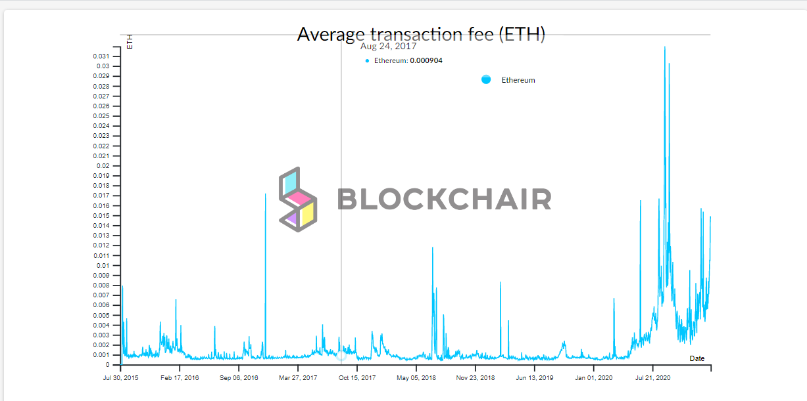

# Fee-Compare
In this project I will show comparison transection fees between defi products (that mostly runs on ETH network) and the solana (SOL) chain.

# Eth Network 

1. The average Ethereum transaction fee has passed $20 for the first time. Ethereum last broke its transaction fee record a month ago on Jan. 11, hitting an average $19 per transaction. Current values double the peak transaction fees recorded during "DeFi Summer" of 2020. 
2. Ethereum Average Transaction Fee measures the average fee in USD when an Ethereum transaction is processed by a miner and confirmed. Average Ethereum transaction fees can spike during periods of congestion on the network, as they did during the 2017 to early 2018 crypto boom where they reached around 3 USD.
3. Ethereum Average Transaction Fee is at a current level of 23.27, up from 16.61 yesterday and up from 0.149 one year ago. This is a change of 40.10% from yesterday and 15.52K% from one year ago.
# According to the Blockchair indicates

